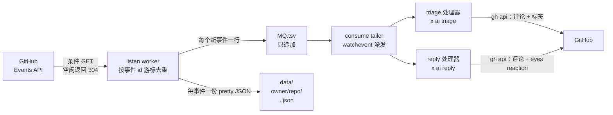

# ghclaw — GitHub 事件的 claw 设计

**ghclaw** 是一种用于 **GitHub 事件**的 *claw 设计*，以 x-cmd
模块形式交付（`x ghclaw`）。它按定时轮询 GitHub **Events
API**，把每个新事件追加到磁盘上的 **只追加 MQ 文件**，再把事件
派发给处理器——最引人注目的是内置的 **AI 智能体**：新 issue 由
`x ai triage` 自动分类打标签，含 `@x` 关键词的评论由
`x ai reply` 起草自动回复，并通过 `gh api` 发回 GitHub。

无需 webhook、无需服务器、无需被监听仓库的管理员权限——只要能
读一个仓库，就能监听它。

> **TL;DR。**
> ```sh
> export GH_TOKEN=<github-token>
> x ghclaw run --repo x-cmd/x-cmd
> ```
> 前台启动对该仓库 events 时间线的监听：新 issue 由
> `x ai triage` 分类打标签，任何含 `@x` 的 issue / PR 评论由
> `x ai reply` 自动回复。退出时全部自动拆除。

## 什么是 "claw 设计"？

"claw"（爪）的隐喻：每个事件被一个 *claw* **抓取**，由它分拣、
分类，然后丢弃、回复或升级。claw 设计有四个部分——在
`ghclaw` 中各自对应具体组件：

1. **Watcher（监听器）**—— `listen` worker。每个轮询周期向
   Events API 发一次*条件请求*（ETag / If-Modified-Since）；
   空闲周期返回 `304`，不消耗 GitHub 速率限制配额。
2. **Classifier（分类器）**—— `watchevent` 派发器。事件到达时
   已是 MQ 中的一行（type、action、actor、title、正文……），
   分类就是零 IO 的行解析加粗筛守卫（`actor` 不是
   `[bot]`、issue/PR 号非空）。
3. **Handlers（处理器）**—— 每种事件一个。`ghclaw` 内置两个
   AI 处理器（triage、reply）作为**一套简单默认方案**；派发
   器可替换为你自己的函数，MQ 对任何消费者开放。
4. **Notifier（通知器）**—— 处理器的输出回到 GitHub：triage
   结果作为评论 + 应用的标签，回复作为评论，均带 ghclaw
   页脚保证幂等。

## ghclaw 为什么存在？

GitHub 对一切动作都产生事件：issue、PR、评论、push、release、
star。标准做法各有摩擦：

- **Webhook** 实时，但需要公网 HTTP 端点，且要对*每个*被监听
  仓库有管理员权限——对不属于你的仓库行不通。
- **云机器人 / Actions** 需要部署服务或逐仓配置 workflow，每
  个新用例都是一个新的小程序。

claw 设计把这些压缩掉：

- **零权限监听。** 轮询 Events API 不需要管理员权限——公共仓、
  别人的仓、组织都可以。私有仓也行，只要你的 token 可读。
- **可推测的文件流。** 每个事件落地为一行只追加 TSV 和一份
  pretty JSON。用 `cat` 和 `awk` 调试，重放就重读文件，手工
  测试就追加一行。MQ 即真相之源，多个消费者可以各自带游标
  读取。
- **内置 AI 处理器。** 新 issue 分类与 `@x` 自动回复开箱即
  用——常见场景不用写任何处理器脚本。
- **空闲零成本。** 条件请求意味着空闲监听消耗速率为零；繁忙
  监听每周期也只花一次请求。

## 开始之前

两样一次性准备：

1. **一个 GitHub token。** `export GH_TOKEN=...`（或
   `GITHUB_TOKEN`）。只监听只需要对目标仓库有读权限；内置的
   回复/打标签处理器需要**写**权限（classic PAT：公共仓用
   `public_repo`，私有仓用 `repo`；fine-grained PAT：对监听
   仓库开 Issues 读/写）。
2. **给 `x ai` 配一个 AI provider**——只有用内置
   triage/reply 时才需要。ghclaw 本身零 AI 配置：`x ai
   reply` / `x ai triage` 在内部解析 provider，你只需为
   x-cmd 配置一次——如 `x minimax apikey=<key>`（或
   `export MINIMAX_API_KEY=...`）。见
   [x ai](https://x-cmd.com/mod/ai)。

## 快速上手

```sh
# 1. 认证 —— 一个能读目标仓库的 token
export GH_TOKEN=<github-token>          # 或 GITHUB_TOKEN

# 2. 一站式前台运行：listen + consume，退出即拆除
x ghclaw run --repo x-cmd/x-cmd

# 3. 或者拆开 —— 后台监听 + 前台消费
x ghclaw listen --repo x-cmd/x-cmd      # 写侧（后台 worker）
x ghclaw consume --repo x-cmd/x-cmd     # 读侧（AI 派发；Ctrl-C 退出）
```

即使没有消费端，listener 也会持续累积事件；两侧完全解耦。

## 看效果

新 issue 到来、有人 @x 时，`x ghclaw consume` 的样子：

```text
[WATCHEVENT] 2026-09-23T08:12:41Z  15218287560  IssuesEvent  opened  x-cmd/x-cmd  alice  42  Login button unresponsive on mobile
[TRIAGE] x-cmd/x-cmd#42 opened — classifying with x ai triage
[TRIAGE] posted triage comment on x-cmd/x-cmd#42
[TRIAGE] labeled x-cmd/x-cmd#42: bug
[WATCHEVENT] 2026-09-23T08:31:07Z  15218311234  IssueCommentEvent  created  x-cmd/x-cmd  bob  42  ,pr  15218311233  @x can you check the CSS regression here?
[REPLY] '@x' matched on x-cmd/x-cmd#42 (IssueCommentEvent by bob) — drafting
[REPLY] reacted :eyes: on x-cmd/x-cmd#42/comment 15218311233
[REPLY] posted reply on x-cmd/x-cmd#42
```

在 GitHub 上，issue #42 会多出一条 triage 评论和 `bug`
标签：

> 🤖 **ai triage**
>
> **Priority:** medium · **Area:** ui
>
> **TL;DR:** Mobile login button unresponsive; likely a
> media-query regression from the last release.
>
> **Suggested labels:** bug
>
> <sub>Triaged by ghclaw</sub>

……而那条 `@x` 评论会收到一个 👀 reaction 和一条 AI 起草、
带 `<sub>Replied by ghclaw</sub>` 页脚的回复。重放同样的事
件不会重复动作——页脚和 reaction 就是幂等标记。

## 命令一览

| 命令 | 作用 |
| --- | --- |
| `x ghclaw run --repo a/b [--interval 1min]` | 一站式前台运行：`listen` + `consume` + `stop`。退出（Ctrl-C）自动拆除监听。 |
| `x ghclaw listen --repo a/b [--interval 30s]` | 启动后台监听（每 target 一个），轮询时间线并追加到 MQ。 |
| `x ghclaw consume --repo a/b` | 前台 tailer：把每行 MQ 派发给内置处理器（Ctrl-C 退出）。 |
| `x ghclaw ls` | 列出活跃监听（target / pid / 启动时间 / 状态）。 |
| `x ghclaw stop <target> [--purge]` | 停止监听；`stop --all` 停止全部。默认保留 MQ 和状态，除非 `--purge`。 |

所有命令接受相同的目标选择参数：

| 选择器 | 监听范围 | 说明 |
| --- | --- | --- |
| `--repo owner/repo` | 单个仓库 | 公共或私有，取决于你的 token 可读范围。 |
| `--org <org>` | 一个组织下的全部仓库 | **仅公共事件**——私有仓仍需逐仓监听。 |
| `--user <name>` | 该用户的个人动态流 | 以人为中心：只含*该用户触发*的事件（跨 GitHub 所有仓）——不是"其名下仓库的全部动态"。 |

`--interval` 接受人性化时间（`30s`、`1min`、`2h30m`；默认
`60s`）。target 统一规范为小写——`Octocat` 与 `octocat` 是同
一个监听。target 也可以按位置参数传入（如
`x ghclaw consume x-cmd/x-cmd`）。

## 工作原理

### 从时间线到 MQ



每个轮询周期一次条件请求。响应体变化时，worker 从新到旧扫
时间线，在保存的 **cursor 事件 id** 处停止——事件 id 是*按事件
类型*独立编号的（绝不能拿来做数值比较），因此只做精确匹配。
若找不到 cursor（特别繁忙的流会把 ~300 条 / 30 天的窗口滚过
去），整批当新事件处理并打 warn 日志。而**首次启动**时第一
个周期什么都不会投递：它把最新事件 id 记为 cursor——
ghclaw 从不回填历史。

请求会对齐到间隔整数倍时刻（`sleep interval - (ts %
interval)`），多个 listener 同时跑时对速率限制更友好。

### 磁盘布局

```
$X_CMD_ROOT_TMP/ghclaw/events/
└── data/
    ├── <target>/
    │   ├── .state/            # etag、lms、cursor、body、hdr
    │   └── .mq/MQ.CURRENT/
    │       └── data.tsv       # 只追加事件队列
    └── <owner>/<repo>/
        └── <type>.<id>.json   # 每事件一份 pretty JSON
```

每事件 JSON 目录**跨 target 共享**：事件 id 全局唯一，同一事件
被单仓监听和组织监听各抓到一次会写同一文件，天然幂等。

### MQ 行格式

每个事件恰好一行，TAB 分隔；字段内无裸 TAB/换行。消费者可以
**零文件 IO** 对一行做粗筛：

| # | 列 | 示例 | 说明 |
| --- | --- | --- | --- |
| 1 | `created_at` | `2026-09-17T11:23:53Z` | GitHub 服务端时间 |
| 2 | `id` | `15214943014` | 事件 id（去重 / 游标锚点） |
| 3 | `type` | `IssuesEvent` | PascalCase 事件类型 |
| 4 | `action` | `opened` | webhook action 的子集；可能为空 |
| 5 | `repo` | `qiakai/test-ghclaw` | `owner/repo`——路由关键列 |
| 6 | `actor` | `lunrenyi` | 机器人带 `[bot]` 后缀 |
| 7 | `number` | `5` | issue / PR 号；可能为空 |
| 8 | `title` | `test: event batch1` | issue/讨论/release 标题 |
| 9 | `detail` | `label:bug` | 按类型的判别信息（见下） |
| 10+ | 可变尾列 | — | 按类型追加；**有正文时正文恒为最后一列**（全文，空白已压平） |

`detail` 列承载快速判别信息：push 的分支名（tag 推送为
`tag:v1`）、review 的 `state:approved`、行内评论的
`path:<文件>`、PR 的 `head->base`、fork 的 `to:<fork 仓>`、
wiki 的 `page:<页名>`、标签事件的 `label:<名>` 等。列不够用
时，完整事件原文在 `data/<repo>/<type>.<id>.json` 一处反查
即得。

### listen / consume 生命周期

- **新监听 = 盲启动。** 新起的监听会清掉残留的轮询状态
  （cursor/etag/lms），然后把 cursor 初始化为*最新*事件——
  历史不会回填。ghclaw 只看到运行期间发生的事件（与 webhook
  一样"停机即盲"）。MQ 只增不减，内置 tailer 从自己的
  index 续读；处理器仍带幂等标记（页脚、reaction），因为
  只追加的 MQ 可能被任何工具重复读取。
- **停机即盲。** 监听停止期间，滚过窗口的事件就丢了；新监听
  从最新事件开始——窗口内残留的内容也不回填。（`since` 对账
  已在路线图上。）
- **stop 保留数据。** `stop` 只杀 worker；加 `--purge` 才会
  同时删除该 target 的 `.state` 和 `.mq`。共享的每事件
  JSON 文件永不动。

## 内置 AI 处理器

下面两个处理器是**当前的默认方案**——刻意保持简单，随后续
版本持续演进（更多处理器、更细的触发条件）。请把它们当作参
考实现而非冻结的 API：稳定的契约是 MQ，真实负载的主路径是
接入你自己的消费者（见 [MQ 协议](1-ghclaw-mq-custom-consumer.cn.md)）。

### Triage：新 issue 自动分类打标签

触发：`IssuesEvent` 且 action 为 `opened`。

1. 行内粗筛；若 issue**已带标签**则跳过（人工或模板已分好类）。
2. 幂等：若该 issue 评论中已有 `Triaged by ghclaw` 页脚则跳过
   ——该标记在监听重启后依然有效。
3. 加载仓库标签词表。**零标签仓库会一次性播种**一套人工选定
   的固定分类法（`bug` / `enhancement` / `docs` / `question` /
   `security` / `performance` / `chore`）——这是 ghclaw 唯一
   会创建标签的地方。
4. `x ai triage --labels <词表>` 完成分类；AI 只能从已存在的
   标签中选择。
5. 发出 triage 评论（priority / area / tldr / 建议标签，带页
   脚），并通过 `gh api` 应用标签——与词表做大小写不敏感匹配、
   落为仓库规范拼写。**AI 建议的名字绝不自动创建**——不会
   长出 `bug` / `Bug` / `defect` 这样的近义异形标签。

### Reply：`@x` 自动回复 issue 与 PR

触发：`IssuesEvent(opened)` 或 `IssueCommentEvent(created)` 的
正文含 `@x`——严格词边界，`a@x.com`、`@xy`、`xx@x2` 都不会触
发。用 `GHCLAW_REPLY_KEYWORD` 可改关键词（如 `@mybot`）。PR
对话区评论同样触发（PR 上的 IssueCommentEvent 也是评论）。

1. **两段式、零浪费**：粗筛只读 MQ 行（type/action/actor/
   number/title 加尾列正文）——零文件 IO。只有关键词命中后才
   反查事件 JSON 拿上下文（如评论背后的 issue 正文）。
2. 语言检测：title/body 含 CJK 字符 → `zh-CN`，否则 `en`；
   写进 prompt 头部。
3. `x ai reply` 起草回复（provider/凭证由 `x ai` 内部解析——
   ghclaw 零配置）。失败或空响应只告警跳过，下一条事件继续。
4. 在**触发对象本身**（评论或 issue）上打 `eyes`（👀）
   reaction——持久的幂等标记。
5. 以 `Replied by ghclaw` 页脚发出回复评论。

### 防回环与幂等，内建三层

| 层 | 机制 |
| --- | --- |
| 机器人过滤 | `actor` 以 `[bot]` 结尾直接跳过（杜绝机器人互聊）。 |
| 页脚自检 | 已含 `Replied by ghclaw` / `Triaged by ghclaw` 的跳过——Events API 看不到评论编辑/删除，页脚是 ghclaw 认出自己作品的方式。 |
| Reaction 标记 | 触发对象已有 👀 reaction 即"已处理"——跨重启、跨 MQ 重放均有效。 |

派发顺序为 **triage 在前、reply 在后**——轻量的分类动作先落
地，耗时的 AI 回复跟在其后。

### 认证与 token 卫生

- 认证来自 `GH_TOKEN` / `GITHUB_TOKEN`（或你的 `gh` 登录
  态）。若缺少 `gh` 二进制，ghclaw 会尝试通过 `x env use gh`
  现场获取。
- token **绝不 export**。每次 `gh` 调用以单次 env 前缀方式传
  入，不会泄漏进你会话里的子进程。

## 事件覆盖

`ghclaw` 跟随 GitHub **Events API**——约 17 种事件类型。其
action 是 webhook 集合的*子集*（webhook 的
`edited`/`deleted`/`synchronize` 等永不出现）：

| 类型 | Actions | 用途 |
| --- | --- | --- |
| `IssuesEvent` | `opened` `closed` `reopened` `assigned` `unassigned` `labeled` `unlabeled` | issue 生命周期；`closed` 带 `state_reason` |
| `IssueCommentEvent` | `created` | issue 或 PR 的新评论（`payload.issue.pull_request` 字段区分） |
| `PullRequestEvent` | `opened` `closed` `merged` `reopened` `assigned` `unassigned` `labeled` `unlabeled` | PR 生命周期。注意：`payload.pull_request` 是**浅对象**（仅 5 键）；需要详情时另调 API |
| `PullRequestReviewEvent` | `created` `updated` `dismissed` | 结论在 `review.state`：`approved` / `changes_requested` / `commented` |
| `PullRequestReviewCommentEvent` | `created` | diff 行内评论 |
| `PushEvent` | — | 推送；只有 `ref`/`before`/`after`，无提交明细 |
| `ReleaseEvent` | `published` | release 发布 |
| `ForkEvent` | `forked` | 仓库被 fork |
| `WatchEvent` | `started` | 被 star |
| `CreateEvent` / `DeleteEvent` | — | 分支/tag 创建与删除 |
| `CommitCommentEvent` | `created` | 对 commit 的评论 |
| `DiscussionEvent` | `created` | 新讨论 |
| `GollumEvent` | — | wiki 页面创建/编辑 |
| `MemberEvent` | `added` | 新增协作者（在邀请*被接受*时触发） |
| `PublicEvent` | — | 私有仓转公开 |
| `SponsorshipEvent` | — | 收到赞助 |

完整 payload 永远只需一次 JSON 文件反查；push 提交明细、PR
标题等需要时按需调 REST API。

## 接入你自己的消费者

内置的 AI triage/reply 处理器只是**默认流水线**——一种现成的
事件反应方式。真正的接口是 MQ 文件本身：启动监听，然后由你
决定监听哪些事件、做什么处理。MQ 契约刻意保持枯燥：一个只
追加 TSV 文件。（深入阅读：[MQ 协议与自定义消费者](1-ghclaw-mq-custom-consumer.cn.md)。）

- **外部消费者**（python、awk、任何东西）自带游标直接读
  `data/<target>/.mq/MQ.CURRENT/data.tsv`——多消费者与重放
  免费获得。
- **替换派发器**：运行 `consume` 前 export
  `___X_CMD_GHCLAW_TAILER_HANDLE=<函数名>`，每条原始 MQ 行
  即改调你的函数，不再走内置流水线（剥列 → 粗筛 → triage →
  reply）。MQ 文件本身不受影响，你的 handler 可与外部游标
  消费共存。

新增事件处理 = 在派发器里加一个分支 + 一个 handler 文件。
一处判断，一处干活。

## 限制——依赖之前先了解

- **轮询延迟。** 默认间隔 60s；繁忙组织若要把 cursor 留在
  ~300 条窗口内，组织级监听可能需 10~30s。不是亚秒级系统。
- **Events API 会丢事件。** GitHub 官方承认：高负载时事件流
  可能丢事件；窗口约 300 条 / 30 天。检测到 cursor 缺口时
  `ghclaw` 会打 warn。另外，每次轮询只读第一页（100 条）——
  一个间隔内爆发更多事件会丢掉尾部，同样以缺口告警暴露。
- **Push 事件延迟 10~40 分钟**——GitHub 推送管道异步写 feed。
  适合"最终一致"型反应，不适合做触发器。
- **评论编辑/删除不可见。** Events API 只报 `created`。ghclaw
  凭页脚认出自己的回复；别人的编辑改动它看不到。
- **没有 CI 事件。** `check_run` / `check_suite` / `status`
  根本不在 Events API 里（那是 webhook 的世界，连同
  `workflow_run` 等 40 余种）。
- **组织级监听仅公共事件**；认证版组织端点是"用户组织
  dashboard"语义，不适合服务端批量监听。私有仓请逐仓监听。
- **`--user` 以人为中心。** 它回答"这个人做了什么"，回答不
  了"他的仓库发生了什么"——其他人在那些仓库的活动不可见。
- **停机即盲**（见上文生命周期）。
- **速率预算。** 认证后 REST 预算为 5000 次/小时；一个
  target 按默认 60s 间隔约耗 60 次/小时（组织级监听算 1
  个 target）。几百个 target 毫无压力——上千个就不行了
  （见[实战手册](2-ghclaw-events-api-playbook.cn.md)）。
- **磁盘增长。** MQ 只增不减，每事件 JSON 持续累积——
  没有任何自动清理。`stop --purge` 只清掉该 target 的状
  态和 MQ（共享 JSON 保留）。清理方法见
  [MQ 协议](1-ghclaw-mq-custom-consumer.cn.md)。

## 排障速查

| 日志 / 现象 | 含义 | 处理 |
| --- | --- | --- |
| `[CONSUME] MQ not found yet` | 该 target 还没有监听写入过 | 启动 `listen`，等一个周期，检查 target 拼写 |
| `[LISTEN] initialized cursor …` | 全新盲启动——"现在"之前的内容不投递 | 每次新启动都会出现，不是故障 |
| `[LISTEN] cursor gap … events lost` | ~300 条窗口滚过了 cursor | 缩短 `--interval`（繁忙组织 10~30s）；丢失不可恢复 |
| `gh CLI unavailable or no token` | 缺 gh 二进制或 token | `export GH_TOKEN=…`、`gh auth login` 或 `x gh init`；`x env use gh` 可装 gh |
| `x ai reply/triage failed` | `x ai` 未配置 AI provider | 如 `x minimax apikey=<key>`——见 [x ai](https://x-cmd.com/mod/ai) |
| `@x` 从不触发 | 不在词边界（`a@x.com`/`@xy`）、actor 是机器人、或触发对象已处理过 | 用干净的 `@x` 评论测试；`GHCLAW_REPLY_KEYWORD` 可改关键词 |
| 事件似乎缺失 | push 延迟 10~40 分钟、高负载丢事件、每轮只读前 100 条 | 见[实战手册](2-ghclaw-events-api-playbook.cn.md)——Events API 不是账本 |

## 路线图

- **更丰富的默认处理器**——内置 triage/reply 刻意保持最简；
  未来会有更多触发条件、更多事件类型和可插拔的配置。MQ
  契约始终是锚点。
- **Webhook 通道**：面向你管理的仓库——实时、全事件集
  （`check_run`、`workflow_run`、评论编辑……），写入同一个
  MQ。轮询保留为无权限底座，并为 webhook 丢失做对账。
- **Notifications 通道**：`@mention`、review 请求与 CI 结果
  ——Events API 看不到它们，但 Notifications API 可以。
  *暂缓：待需求出现时再加，无时间表。*
- **`since` 对账**：补回监听停机期间错过的事件。

## 何时用 vs 何时不用

**适合用 ghclaw 的场景：**

- 想要 AI 辅助的 GitHub 分类 / 自动回复，**不想跑服务器**、
  不想配 webhook。
- 监听你没有管理员权限的仓库——轮询只需读权限。
- 想用一个监听器覆盖多种事件类型，且事件流可检视、可重放
  （纯文件）。
- 想通过替换一个派发函数接入自定义 handler，或直接用自己
  的工具读 MQ。

**不适合的场景：**

- 需要亚秒级延迟或送达保证（webhook 或 GitHub App 才是对的
  工具——将来 ghclaw 也可能通过 webhook 通道与它们互补）。
- 需要 CI 结果、评论编辑/删除事件或 `workflow_run` 触发——
  这些在 Events API 里不存在。
- 需要监听几千个仓库——~300 条窗口决定了轮询的批量上限大
  致在组织级；超出请走组织 webhook / GitHub App。

## 源码与资源

- **源码：** <https://github.com/x-bash/ghclaw>
- **模块：** <https://github.com/x-cmd/x-cmd>（`mod/ghclaw/`）
- **GitHub Events API：**
  <https://docs.github.com/en/rest/activity/events>
- **x ai：** <https://x-cmd.com/mod/ai>
- **x env (gh)：** <https://x-cmd.com/mod/env>
