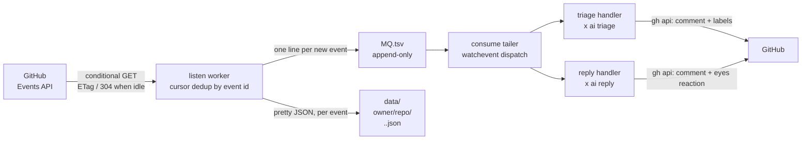

# ghclaw — A Claw Design for GitHub Events

**ghclaw** is a *claw design* for **GitHub events**, shipped as an
x-cmd module (`x ghclaw`). It polls the GitHub **Events API** on a
timer, appends every new event to an **append-only MQ file** on
disk, and dispatches each event to a handler — most notably the
built-in **AI agents**: new issues get auto-triaged and labeled,
and comments containing the `@x` keyword get an AI-drafted reply,
posted back to GitHub via `gh api`.

No webhook, no server, no admin access to the watched repos — if
you can read a repo, you can watch it.

> **TL;DR.**
> ```sh
> export GH_TOKEN=<github-token>
> x ghclaw run --repo x-cmd/x-cmd
> ```
> This starts watching the repo's events timeline in the
> foreground: new issues are classified and labeled by
> `x ai triage`, and any issue / PR comment containing `@x`
> is answered by `x ai reply`. Everything tears down on exit.

## What is a "claw design"?

The "claw" metaphor: every event is **grabbed** by a *claw* that
sorts it, classifies it, and either drops it, replies to it, or
escalates it. A claw design has four pieces — in `ghclaw` each
maps to a concrete component:

1. **Watcher** — the `listen` worker. Once per interval it sends
   a *conditional* request to the Events API (ETag /
   If-Modified-Since); an idle period returns `304` and costs
   nothing against the GitHub rate limit.
2. **Classifier** — the `watchevent` dispatcher. Each event
   already arrived as one line of the MQ (type, action, actor,
   title, body…), so classification is a zero-IO line parse plus
   a coarse guard (`actor` is not a `[bot]`, issue/PR number
   present).
3. **Handlers** — one per event kind. `ghclaw` ships two
   built-in AI handlers (triage, reply) as a **simple default
   set**; the dispatcher is replaceable with your own function,
   and the MQ is open to any consumer.
4. **Notifier** — the handlers' outputs go back to GitHub:
   triage results as a comment + applied labels, replies as
   comments, each carrying a `ghclaw` footer for idempotency.

## Why does ghclaw exist?

GitHub fires events for everything: issues, PRs, comments,
pushes, releases, stars. The standard reactions each have
friction:

- **Webhooks** are real-time, but need a public HTTP endpoint
  and admin rights on *each* watched repo — impossible for repos
  you don't own.
- **Cloud bots / Actions** need a deployed service or per-repo
  workflow files, and each new use case is a new small program.

The claw design collapses this:

- **Permission-free watching.** Polling the Events API needs no
  admin rights — public repos, other people's repos, orgs all
  work. Private repos work too, as far as your token can read.
- **Plausible file flow.** Every event lands as a line in an
  append-only TSV and a pretty JSON file. Debug with `cat` and
  `awk`, replay by re-reading the file, hand-test by appending a
  line. The MQ is the source of truth, and multiple consumers
  can read it with independent cursors.
- **Built-in AI handlers.** New-issue triage and `@x` auto-reply
  ship out of the box — no handler scripts to write for the
  common cases.
- **Cheap when idle.** Conditional requests mean an idle watch
  costs zero rate-limit budget; a busy watch costs one request
  per interval.

## Before you start

Two things to prepare — both one-time:

1. **A GitHub token.** `export GH_TOKEN=...` (or
   `GITHUB_TOKEN`). Watching alone only needs read access to
   the target repos; the built-in reply/triage handlers need
   **write** access (classic PAT: `public_repo` for public
   repos, `repo` for private ones; fine-grained PAT: Issues
   read/write on the watched repos).
2. **An AI provider for `x ai`** — only if you use the
   built-in triage/reply. ghclaw itself has zero AI
   configuration: `x ai reply` / `x ai triage` resolve the
   provider internally, and you configure it once for x-cmd —
   e.g. `x minimax apikey=<key>` (or `export
   MINIMAX_API_KEY=...`). See [x ai](https://x-cmd.com/mod/ai).

## Quick start

```sh
# 1. Auth — a token that can read the target repo(s)
export GH_TOKEN=<github-token>          # or GITHUB_TOKEN

# 2. Foreground all-in-one: listen + consume, teardown on exit
x ghclaw run --repo x-cmd/x-cmd

# 3. Or split it — background listener + foreground consumer
x ghclaw listen --repo x-cmd/x-cmd      # writer (background worker)
x ghclaw consume --repo x-cmd/x-cmd     # reader (AI dispatch; Ctrl-C to exit)
```

The listener keeps accumulating events even while nobody
consumes; the two sides are fully decoupled.

## See it in action

What `x ghclaw consume` looks like when a new issue arrives
and someone pings `@x`:

```text
[WATCHEVENT] 2026-09-23T08:12:41Z  15218287560  IssuesEvent  opened  x-cmd/x-cmd  alice  42  Login button unresponsive on mobile
[TRIAGE] x-cmd/x-cmd#42 opened — classifying with x ai triage
[TRIAGE] posted triage comment on x-cmd/x-cmd#42
[TRIAGE] labeled x-cmd/x-cmd#42: bug
[WATCHEVENT] 2026-09-23T08:31:07Z  15218311234  IssueCommentEvent  created  x-cmd/x-cmd  bob  42  ,pr  15218311233  @x can you check the CSS regression here?
[REPLY] '@x' matched on x-cmd/x-cmd#42 (IssueCommentEvent by bob) — drafting
[REPLY] reacted :eyes: on x-cmd/x-cmd#42/comment 15218311233
[REPLY] posted reply on x-cmd/x-cmd#42
```

On GitHub, issue #42 now carries a triage comment and the
`bug` label:

> 🤖 **ai triage**
>
> **Priority:** medium · **Area:** ui
>
> **TL;DR:** Mobile login button unresponsive; likely a
> media-query regression from the last release.
>
> **Suggested labels:** bug
>
> <sub>Triaged by ghclaw</sub>

… and the `@x` comment gets an 👀 reaction plus an AI-drafted
reply signed `<sub>Replied by ghclaw</sub>`. Replayed events
don't duplicate — the footer and the reaction are the
idempotency marks.

## Commands

| Command | Role |
| --- | --- |
| `x ghclaw run --repo a/b [--interval 1min]` | All-in-one foreground runtime: `listen` + `consume` + `stop`. Exit (Ctrl-C) tears the listener down. |
| `x ghclaw listen --repo a/b [--interval 30s]` | Start a background listener (one per target) that polls the timeline and appends to the MQ. |
| `x ghclaw consume --repo a/b` | Foreground tailer: dispatch each MQ line to the built-in handlers (Ctrl-C to exit). |
| `x ghclaw ls` | List active listeners (target / pid / start time / state). |
| `x ghclaw stop <target> [--purge]` | Stop a listener; `stop --all` stops every one. Keeps MQ and state unless `--purge`. |

Every command takes the same target selector:

| Selector | Watches | Notes |
| --- | --- | --- |
| `--repo owner/repo` | One repository | Public or private, as far as your token can read. |
| `--org <org>` | All repos of an organization | **Public events only** — private repos still need per-repo listening. |
| `--user <name>` | The user's own activity stream | Actor-centric: only events *the user triggered*, anywhere on GitHub — not "everything in the user's repos". |

`--interval` takes human time (`30s`, `1min`, `2h30m`; default
`60s`). Targets are normalized to lowercase — `Octocat` and
`octocat` are the same listener. A target can also be passed
positionally (`x ghclaw consume x-cmd/x-cmd`).

## How it works

### From timeline to MQ



Each poll cycle is one conditional request. When the body
changes, the worker walks the timeline newest→oldest and stops
at the stored **cursor event id** — event ids are numbered
*per event type* (never compare them numerically), so the check
is exact-match only. If the cursor can't be found (a very busy
stream can roll the ~300-event / 30-day window past it), the
whole batch is treated as new and a warning is logged. And on a
**fresh start** the first cycle delivers nothing at all: it
records the newest event id as the cursor, so ghclaw never
backfills history.

Requests are aligned to interval boundaries
(`sleep interval - (ts % interval)`), which is kinder to the
rate limit when several listeners run.

### On-disk layout

```
$X_CMD_ROOT_TMP/ghclaw/events/
└── data/
    ├── <target>/
    │   ├── .state/            # etag, lms, cursor, body, hdr
    │   └── .mq/MQ.CURRENT/
    │       └── data.tsv       # append-only event queue
    └── <owner>/<repo>/
        └── <type>.<id>.json   # one pretty JSON per event
```

The per-event JSON directory is **shared across targets**:
event ids are globally unique, so the same event seen from a
repo listener and an org listener overwrites the same file —
naturally idempotent.

### The MQ line format

One event per line, TAB-separated; no bare TAB/newline inside
fields. Consumers can coarse-filter a row **without touching any
other file**:

| # | Column | Example | Notes |
| --- | --- | --- | --- |
| 1 | `created_at` | `2026-09-17T11:23:53Z` | GitHub server time |
| 2 | `id` | `15214943014` | Event id (dedup/cursor anchor) |
| 3 | `type` | `IssuesEvent` | PascalCase event type |
| 4 | `action` | `opened` | Subset of webhook actions; may be empty |
| 5 | `repo` | `qiakai/test-ghclaw` | `owner/repo` — the routing key |
| 6 | `actor` | `lunrenyi` | `[bot]`-suffixed for bots |
| 7 | `number` | `5` | Issue / PR number; may be empty |
| 8 | `title` | `test: event batch1` | Issue/discussion/release title |
| 9 | `detail` | `label:bug` | Per-type discriminator (see below) |
| 10+ | trailing columns | — | Type-specific; **when a body is present it is always the last column** (full text, whitespace-flattened) |

`detail` carries the quick discriminator per type: branch name
for pushes (`tag:v1` for tags), `state:approved` for reviews,
`path:<file>` for diff comments, `head->base` for PRs, `to:<fork>`
for forks, `page:<name>` for wiki edits, `label:<name>` for
label events, and so on. When a column isn't enough, the full
event payload is one file lookup away at
`data/<repo>/<type>.<id>.json`.

### Listen / consume lifecycle

- **Fresh start = blind start.** A new listener clears any
  leftover poll state (cursor/etag/lms), then initializes its
  cursor at the *newest* event — history is not backfilled.
  ghclaw only sees events that occur while it runs (same
  "offline = blind" semantics as a webhook). The MQ never
  shrinks and the built-in tailer resumes from its own index;
  handlers still carry idempotency marks (footers, reactions)
  because the append-only MQ may be re-read by any tool.
- **Stopped listener is blind.** While stopped, events that
  roll past the window are gone, and a fresh listener starts at
  the newest event — no backfill. (A `since` reconciliation mode
  is on the roadmap.)
- **stop keeps data.** `stop` kills only the worker; add
  `--purge` to also drop that target's `.state` and `.mq`. The
  shared per-event JSON files are never touched.

## Built-in AI handlers

The two handlers below are the **current default set** —
deliberately simple, and expected to evolve (more handlers,
finer triggers) as the module matures. Treat them as reference
implementations rather than a frozen API: the stable contract
is the MQ, and the main path for real workloads is wiring your
own consumers ([MQ protocol](1-ghclaw-mq-custom-consumer.en.md)).

### Triage: classify and label new issues

Trigger: `IssuesEvent` with action `opened`.

1. Coarse-filter the MQ line; skip if the issue **already has
   labels** (a human or template already classified it).
2. Idempotency: skip if the issue's comments already contain a
   `Triaged by ghclaw` footer — this survives listener restarts.
3. Load the repo's label vocabulary. A **zero-label repo is
   seeded once** with a fixed human-curated taxonomy
   (`bug` / `enhancement` / `docs` / `question` / `security` /
   `performance` / `chore`) — the only place ghclaw ever creates
   labels.
4. `x ai triage --labels <vocabulary>` classifies the issue;
   the AI may only pick from labels that already exist.
5. A triage comment (priority / area / tldr / suggested labels,
   with the footer) is posted, and the labels are applied via
   `gh api` with case-insensitive matching to the repo's
   canonical spelling. **AI suggestions never auto-create
   labels** — no `bug` / `Bug` / `defect` proliferation.

### Reply: answer `@x` in issues and PRs

Trigger: `IssuesEvent(opened)` or `IssueCommentEvent(created)`
whose body contains `@x` — strict word boundaries, so
`a@x.com`, `@xy`, `xx@x2` do not fire. Change the keyword with
`GHCLAW_REPLY_KEYWORD` (e.g. `@mybot`). PR conversation comments
are included (an `IssueCommentEvent` on a PR is still a comment).

1. **Two-phase, zero-waste**: the coarse filter reads only the
   MQ line (type/action/actor/number/title plus the trailing
   body column) — no file IO. Only when the keyword hits does
   the handler fetch the event JSON for extra context (e.g. the
   issue body behind a comment).
2. Language detection: CJK characters in title/body → `zh-CN`,
   otherwise `en`; written into the prompt.
3. `x ai reply` drafts the answer (provider/credentials
   resolved inside `x ai` — zero ghclaw config). A failed or
   empty response just warns and skips; the next event
   continues.
4. An `eyes` (👀) reaction is placed **on the triggering
   comment or issue itself** — the persistent idempotency mark.
5. The reply is posted as a comment with a
   `Replied by ghclaw` footer.

### Anti-loop and idempotency, by design

| Layer | Mechanism |
| --- | --- |
| Bot filter | `actor` ending in `[bot]` is skipped (no bot ping-pong). |
| Footer check | Anything already containing `Replied by ghclaw` / `Triaged by ghclaw` is skipped — the Events API can't see comment edits/deletes, so footers are how ghclaw recognizes its own work. |
| Reaction marker | The trigger object carrying an 👀 reaction means "handled" — survives restarts and MQ replays. |

Dispatch order is **triage first, then reply** — the cheap,
classifying action lands before the slower AI reply.

### Auth and token hygiene

- Auth comes from `GH_TOKEN` / `GITHUB_TOKEN` (or your `gh`
  login state). If the `gh` binary is missing, ghclaw offers to
  fetch one via `x env use gh`.
- Tokens are **never exported**. Each `gh` call receives the
  token as a one-shot environment prefix, so it never leaks
  into child processes of your session.

## Event coverage

`ghclaw` follows the GitHub **Events API** — about 17 event
types. Its actions are a *subset* of the webhook set (the
webhook's `edited`/`deleted`/`synchronize` etc. never appear):

| Type | Actions | What it's for |
| --- | --- | --- |
| `IssuesEvent` | `opened` `closed` `reopened` `assigned` `unassigned` `labeled` `unlabeled` | Issue lifecycle; `closed` carries `state_reason` |
| `IssueCommentEvent` | `created` | New comment on an issue or PR (`payload.issue.pull_request` tells which) |
| `PullRequestEvent` | `opened` `closed` `merged` `reopened` `assigned` `unassigned` `labeled` `unlabeled` | PR lifecycle. Note: `payload.pull_request` is a **shallow** object (5 keys); fetch details via API when needed |
| `PullRequestReviewEvent` | `created` `updated` `dismissed` | The verdict is in `review.state`: `approved` / `changes_requested` / `commented` |
| `PullRequestReviewCommentEvent` | `created` | Diff line comments |
| `PushEvent` | — | Push; only `ref`/`before`/`after`, no commit list |
| `ReleaseEvent` | `published` | Release published |
| `ForkEvent` | `forked` | Repo forked |
| `WatchEvent` | `started` | Starred |
| `CreateEvent` / `DeleteEvent` | — | Branch/tag created or deleted |
| `CommitCommentEvent` | `created` | Comment on a commit |
| `DiscussionEvent` | `created` | New discussion |
| `GollumEvent` | — | Wiki page created/edited |
| `MemberEvent` | `added` | Collaborator added (fires when the invitation is *accepted*) |
| `PublicEvent` | — | Private repo turned public |
| `SponsorshipEvent` | — | Sponsorship received |

The full payload is always one JSON-file lookup away, and for
push commits or PR titles you can always call the REST API on
demand.

## Bring your own consumer

The built-in AI triage/reply handlers are just the **default
pipeline** — one opinionated way to react to events. The real
interface is the MQ file itself: start a listener, then decide
for yourself which events to watch and what to do with them.
The MQ contract is deliberately boring: an append-only TSV
file. (Deep dive: [The MQ protocol & custom consumers](1-ghclaw-mq-custom-consumer.en.md).)

- **External consumers** (python, awk, anything) keep their own
  cursor and read `data/<target>/.mq/MQ.CURRENT/data.tsv`
  directly — multi-consumer and replay come for free.
- **Replace the dispatcher**: export
  `___X_CMD_GHCLAW_TAILER_HANDLE=<func>` before running
  `consume`, and each raw MQ line goes to your function instead
  of the built-in pipeline (peel → guards → triage → reply).
  The MQ file itself is untouched, so your handler can coexist
  with external cursor consumers.

Adding a new event action = add a branch to the dispatcher and a
handler file. One place judges, one place works.

## Limits — know them before you rely on it

- **Polling latency.** Default interval 60s; org-wide watches on
  busy orgs may need 10–30s to keep the cursor inside the
  ~300-event window. Not a sub-second system.
- **The Events API loses events.** GitHub says so: under load
  the stream can drop events; the window is ~300 events / 30
  days. `ghclaw` logs a warning when it detects a cursor gap.
  Also, each poll reads only the first page (100 events) — a
  burst bigger than that within one interval loses its tail,
  again surfaced as a gap warning.
- **Push events lag 10–40 minutes** through GitHub's feed
  pipeline — fine for "eventually consistent" reactions, not
  for triggers.
- **Comment edits/deletes are invisible.** The Events API only
  reports `created`. ghclaw's own replies are recognized by
  footer; foreign edits simply aren't seen.
- **No CI events.** `check_run` / `check_suite` / `status` are
  not part of the Events API at all (that's a webhook-only
  world, alongside `workflow_run` and 40+ more webhook types).
- **Org watching is public-only**; the authenticated org
  endpoint is a per-user dashboard, not a server-side bulk
  stream. Private repos: listen per repo.
- **`--user` is actor-centric.** It answers "what did this
  person do", not "what happened in their repos" — everyone
  else's activity there is invisible.
- **A stopped listener is blind** (see lifecycle above).
- **Rate budget math.** The authenticated REST budget is 5,000
  requests/hour; one target at the default 60s interval costs
  ~60 requests/hour (org-wide watching counts as one target).
  Hundreds of targets are comfortable — thousands are not
  (see [the playbook](2-ghclaw-events-api-playbook.en.md)).
- **Disk growth.** The MQ appends forever and the per-event
  JSON files accumulate — nothing is pruned automatically.
  `stop --purge` clears one target's state and MQ (the shared
  JSON stays). Housekeeping recipes: [the MQ protocol](1-ghclaw-mq-custom-consumer.en.md).

## Troubleshooting

| Log line / symptom | Meaning | Fix |
| --- | --- | --- |
| `[CONSUME] MQ not found yet` | no listener has written for this target yet | start `listen`, wait one interval, check the target spelling |
| `[LISTEN] initialized cursor …` | fresh blind start — nothing before "now" is delivered | expected on every new start; not a bug |
| `[LISTEN] cursor gap … events lost` | the ~300-event window rolled past your cursor | shorten `--interval` (10–30s on busy orgs); lost events stay lost |
| `gh CLI unavailable or no token` | missing `gh` binary or token | `export GH_TOKEN=…`, `gh auth login` or `x gh init`; `x env use gh` fetches the binary |
| `x ai reply/triage failed` | no AI provider configured for `x ai` | e.g. `x minimax apikey=<key>` — see [x ai](https://x-cmd.com/mod/ai) |
| `@x` never fires | not at a word boundary (`a@x.com` / `@xy`), bot actor, or the trigger was already handled | test with a clean `@x` comment; change via `GHCLAW_REPLY_KEYWORD` |
| events seem missing | push lag 10–40 min, stream loss under load, 100-events-per-poll cap | see [the playbook](2-ghclaw-events-api-playbook.en.md) — the Events API is not a ledger |

## Roadmap

- **Richer default handlers** — the built-in triage/reply set is
  intentionally minimal; expect more triggers, more event types
  and pluggable handler configs over time. The MQ contract stays
  the anchor.
- **Webhook channel** for repos you manage: real-time, full
  event set (`check_run`, `workflow_run`, comment edits…),
  feeding the same MQ. Polling stays as the permission-free
  base and as reconciliation for webhook loss.
- **Notifications channel**: `@mention`, review requests and
  CI results — the Events API can't see them, but the
  Notifications API can. *Deferred: added when demand shows
  up; no timeline.*
- **`since` reconciliation** to backfill events missed while a
  listener was stopped.

## When to use vs when NOT

**Use ghclaw when:**

- You want AI-assisted GitHub triage / auto-reply **without
  running a server** or configuring webhooks.
- You watch repos you don't admin — polling needs no
  permissions beyond read.
- You want one watcher for many event types, with the event
  flow inspectable and replayable as plain files.
- You want to plug in custom handlers by replacing one
  dispatcher function, or just read the MQ from your own tool.

**Don't use ghclaw when:**

- You need sub-second latency or guaranteed delivery (webhooks
  or a GitHub App are the right tool — ghclaw may complement
  them later via the webhook channel).
- You need CI results, comment edit/delete events, or
  `workflow_run` triggers — none of these exist in the Events
  API.
- You need to watch thousands of repos — the ~300-event window
  caps polling's bulk reach at roughly org scale; beyond that,
  org webhooks / a GitHub App are the ceiling.

## Source & Resources

- **Source:** <https://github.com/x-bash/ghclaw>
- **Module:** <https://github.com/x-cmd/x-cmd> (`mod/ghclaw/`)
- **GitHub Events API:** <https://docs.github.com/en/rest/activity/events>
- **x ai:** <https://x-cmd.com/mod/ai>
- **x env (gh):** <https://x-cmd.com/mod/env>
